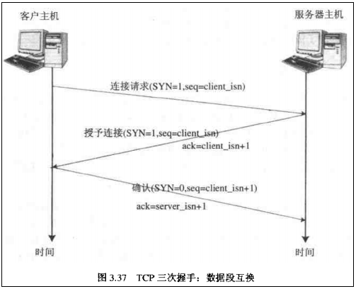

# 《图解HTTP》学习笔记

* TCP/IP是互联网相关的各类协议族的总呼 。

* TCP/IP协议族按层次分别为以下四层：
    1. **应用层**；
    2. **传输层**；
    3. **网络层**；
    4. **数据链路层**；
    
***

### TCP/IP各层作用：

* **应用层：**
    应用层决定了向用户提供应用服务时通信的活动。
    
    TCP/IP协议族内预存了各类通用的应用服务。比如，FTP（文件传输协议）和DNS(域名系统)服务就是其中两大类。
    **HTTP协议也处于该层。**   

* **传输层：**
    传输层对上层应用层，提供处于网络连接中的两台计算机之间的数据传输。

    在传输层有两个性质不同的协议：TCP(传输控制协议) 和 UDP(用户数据报协议)。

* **网络层（又名网络互连层）：**
    网络层是用来处理在网络上流动的数据包。数据包是网络传输的最小数据单位。

    该层规定了通过怎样的路径(所谓的传输路线)到达对方计算机上，并把数据包传送给对方。

    与对方计算机之间通过多台计算机或网络设备进行传输时,网络层所起的作用就是在众多的选项中选择一条传输路线。

* **链路层（又名 数据链路层、网络接口层）：**
    用来处理连接网络的硬件部分。
    包括控制操作系统、硬件的设备驱动、NIC(网络适配器，即网卡)，及光纤等物理可见部分（还包括连接器等一切传输媒介）。
    硬件上的范畴可在链路层的作用范围之内。

***

### TCP/IP的三次握手：
- 第一次握手：
    建立连接时，客户端发送syn包（syn=j）到服务器，并进入SYN_SENT状态，等待服务器确认；SYN：同步序列编号（Synchronize Sequence Numbers）。

- 第二次握手：
    服务器收到syn包，必须确认客户的SYN（ack=j+1），同时自己也发送一个SYN包（syn=k），即SYN+ACK包，此时服务器进入SYN_RECV状态；

- 第三次握手：
    客户端收到服务器的SYN+ACK包，向服务器发送确认包ACK(ack=k+1），此包发送完毕，客户端和服务器进入ESTABLISHED（TCP连接成功）状态，完成三次握手。
    如下图所示：

完成三次握手，客户端与服务器开始传送数据。如下图所示：

断开连接时则为四次握手，如图所示：

***